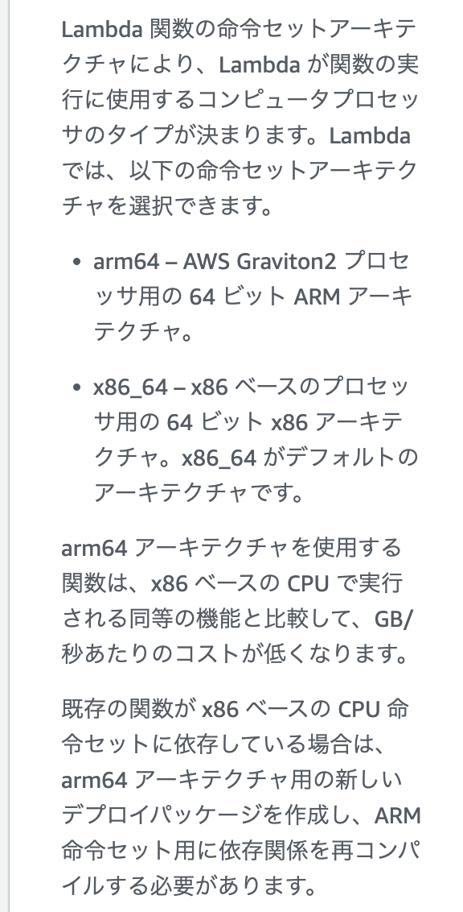

## 元記事

https://community.aws/content/2drvjYx2tABYr3ghVWzIIwx3KM7/building-go-applications-for-aws-graviton?lang=en

## メモ内容

lambdaのコンソール画面を見ると、aws graviton2用にコンパイルすると安くなると書いてある。



よって、安くなるようなコンパイルができる方法を探した

```
export GOOS=linux
export GOARCH=arm64

go build -o goLinkShortener_arm64
```